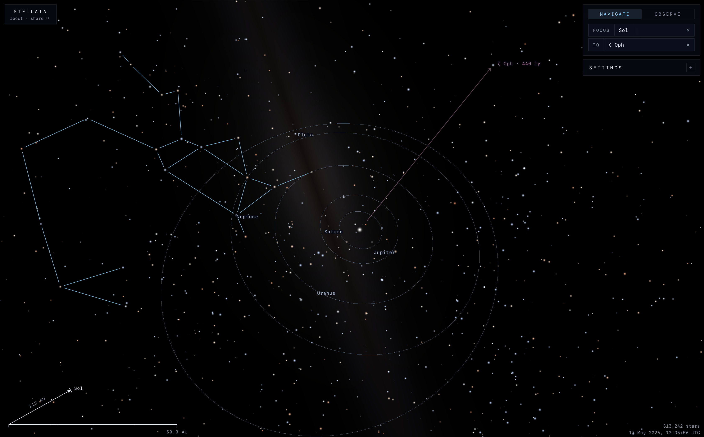
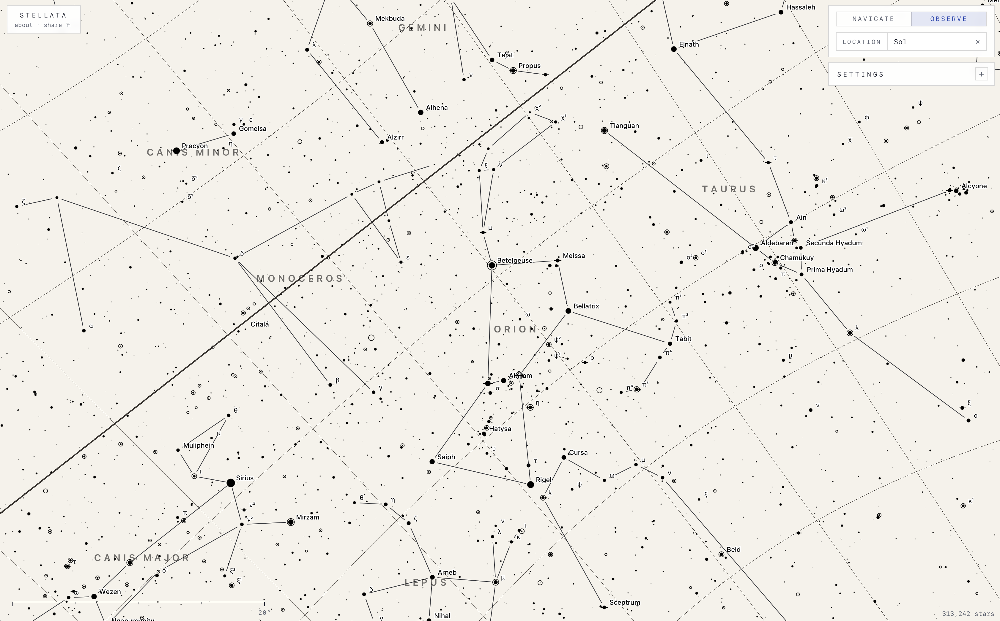

# Stellata

*Explore the universe.*

A physically accurate 3D model of our local corner of the universe at every
scale astronomy has measured it. Experience what it would actually look
like to *be there*: from individual stars and their planets, through the local
interstellar medium, out to the structure of the galactic disc, and
beyond into the intergalactic void.

Every object in Stellata comes from a published observational
catalogue and direct measurement: if we've measured it, it's
here. Theoretical predictions and conjectured structures are excluded. The
model's scope is bounded by what has been observed, currently enclosing
a volume up to 6.5 million light years from our solar system.

Try it at **[https://stellata.xyz](https://stellata.xyz)**.

<!-- TODO: hero screenshot — recommended: a few hundred pc out from
     Sol, looking back through the Milky Way band, constellation lines
     on, HUD ring + Sol/GC arrows visible. Conveys the "real 3D
     galaxy you can navigate" framing in one image. -->



## Highlights

- **Everything is rendered live, from where you are.** Stars (more than
  313,000 in the catalogue), planets, the volumetric Milky Way, the
  Local Group dwarf galaxies, and the 3D dust between them: every
  object continually re-renders against the current camera each frame.
  Fly halfway to Sirius and the sky changes: parallax, reddening, and 
  occlusion are all real, not fabricated.

- **Close-up stars resolve as physical objects.** Approach a star and
  it stops being a dot: its disc grows to its actual radius (from
  catalogue absolute magnitude + spectral class via Stefan–Boltzmann)
  and occludes whatever is behind it. Supergiants like Betelgeuse
  fill half the viewport; white dwarfs render as crisp small points.

- **Interstellar dust dims and reddens stars correctly.** The vertex
  shader raymarches the Edenhofer 2023 3D dust map from camera to
  star at run time, so stars behind dense ISM look fainter and
  redder, exactly as you would see them.

- **Variable stars pulsate.** ~3,700 stars cross-matched with GCVS
  pulse on time-compressed cycles: Cepheids in seconds, Miras in a
  minute, Betelgeuse in ~8 minutes. Visible both as brightness
  swing and as physical disc-radius change at close range.

- **The solar system at live planetary positions.** Around Sol, the
  eight planets and Pluto render at their current heliocentric
  positions (JPL Standish ephemerides, sub-arcminute accurate
  3000 BC – 3000 AD), inside the asymmetric heliopause shell
  measured by Voyager and IBEX. A small clock in the corner shows
  the UTC time the positions correspond to.

- **The Milky Way is volumetric, not a skybox.** A bounded raymarch
  through galactic-scale density meshes produces the surface-
  brightness band. Fly past the galactic centre and it reorients
  with proper parallax. Analytical mid-plane dust means the dark
  lane reads correctly.

- **A paper-chart mode for when you want to read the sky like a
  star atlas.** A second visual mode is inspired by Sky Atlas 2000.0:
  flat hard-edged discs sized by apparent magnitude, full
  Bayer/Flamsteed labels, constellation names, double-star wings,
  variable-star rings.

<!-- TODO: second screenshot — recommended: star chart mode at a
     constellation-scale FOV (Orion or Cygnus works well), showing
     the paper aesthetic, Bayer letters, and a couple of binary
     glyphs. Visually very distinct from the photographic mode
     above. -->



- **Navigate, observe, warp.** Orbit any star (navigate), or land on
  it and look at the sky from its location (observe). Pick a second star
  to measure the distance, then warp: an animated camera flight
  between the two stars with full physical scaling.

- **Shareable views.** All settings plus camera pose pack into the
  current URL, so any view can be bookmarked and shared.

## Grounded in published science

Everything you see is calibrated against the source data. Star sizes
come from absolute magnitudes via Stefan–Boltzmann; halo softness
tracks MK luminosity class; binaries come from the Hipparcos CCDM
cross-reference filtered by MultFlag; dwarf galaxies in the Local
Group come from Pace 2024's Local Volume Database with hand-curated
structural detail for the LMC, SMC, M31, M33, and Sagittarius dSph
from the primary literature.

The full record of sources, formulas, and deliberate modelling
simplifications lives in **[SCIENCE.md](./SCIENCE.md)**. Read for
citations, DOIs, and what is and isn't observationally grounded.

## Things to try

Stellata rewards exploration more than reading. A short curated list
of viewpoints and objects, each chosen because it exercises something
the renderer does that doesn't quite show up in a screenshot.

### See the giants as physical objects

Approach these slowly. The discs grow to the star's real radius
computed from its catalogued absolute magnitude and spectral class,
so they fill the viewport long before you'd expect.

- **Betelgeuse (α Orionis)** — the canonical red supergiant.
  M2 Ia at 152 pc; the disc resolves to a large fraction of the
  viewport at close range and pulses on an ~8-minute cycle.
- **Antares (α Scorpii)** — the other canonical red supergiant.
  M1.5 Iab at 170 pc. Visibly redder than Betelgeuse.
- **Rigel (β Orionis)** — blue supergiant in the same constellation
  as Betelgeuse. B8 Ia at 265 pc, intrinsically brighter than
  Betelgeuse — but hotter, so Stefan–Boltzmann gives it a smaller
  physical radius. The Rigel / Betelgeuse pair makes the L = R²T⁴
  trade-off visible.
- **Deneb (α Cygni)** — A2 Ia supergiant at 433 pc, in Cygnus.
  Renders as a notably bright white-blue disc.

### Watch variables pulse in real time

Stellata compresses time so periods you'd never see in a human
lifetime cycle in seconds. Focus on one of these and just wait:

- **δ Cephei** — the namesake Cepheid. Full cycle in a few seconds.
- **η Aquilae** — another bright classical Cepheid.
- **Mira (o Ceti)** — the long-period prototype. ~1 minute per
  cycle; amplitude is dramatic.
- **Betelgeuse** — slower (~8 minutes per cycle) but visible as
  both brightness swing and physical disc-radius pulse if you're
  focused close in.

### Fly out and watch the constellations break

The constellation lines come from Earth's viewpoint. Move just a
few tens of parsecs and the figures visibly deform — this is the
moment the model stops being a planetarium and starts being a 3D
map.

- **Orion** — Betelgeuse (~152 pc) and Rigel (~265 pc) are at very
  different distances; flying through Orion stretches the figure
  asymmetrically.
- **Big Dipper / Ursa Major** — most members belong to the Ursa
  Major moving group, but Dubhe (α UMa) and Alkaid (η UMa) don't.
  The asterism breaks lopsidedly as you back away.
- **Cygnus** — Deneb is at ~433 pc, the rest of the Northern Cross
  much closer. Backing the camera off tilts the cross dramatically.

### Visual doubles, in chart mode

Switch to chart mode while observing from a focused star to see
the double-star wings glyph. The model flags ~13,000 doubles via
the Hipparcos CCDM cross-match.

- **α Centauri** — uniquely, both A and B render as separate discs
  (caught by the geometric pass, not the CCDM one). Get close and
  you can orbit between them.
- **Mizar + Alcor (ζ + 80 UMa)** — the classic naked-eye double.
  Mizar carries the wings glyph; Alcor is a separate star nearby.
- **ε Lyrae** — the "double double". Carries the multiplicity glyph.
- **Albireo (β Cygni)** — only the primary renders, but the glyph
  is there. Celebrated for its real-world gold/blue colour contrast.

### Beyond the heliopause

The default first-load view parks you 5 AU from Sol facing the
galactic centre — a deliberate "you are here, that's our system"
anchor. From there:

- **From Pluto, looking inward.** The Sun is just one bright star
  among many; the heliopause shell sits overhead.
- **Cross the heliopause at the upwind apex (~122 AU) and look
  back.** The model's asymmetry — ~115 AU at the flanks, ~200 AU
  into the heliotail — reads from outside the bubble.

### Galactic-scale views

The Milky Way is volumetric, not a skybox. These viewpoints prove it:

- **Park 8 kpc above the galactic centre and look down.** The disc
  and bulge render as illuminated 3D structures; their orientation
  responds to camera motion.
- **Stand on a star a few kpc out and look around.** The MW band
  wraps continuously, with parallax that wouldn't be possible from
  a flat backdrop.
- **Fly toward the galactic centre.** As you cross into the bulge
  the surface brightness ramps; analytical mid-plane dust darkens
  stars on lines of sight through the densest gas.

### Local Group destinations

For ambitious distances. The Local Group layer renders LineLoop
wireframes for confirmed-galaxy members out to 2 Mpc.

- **Sagittarius dSph** (~26 kpc) — our closest companion dwarf,
  currently being tidally torn apart by the MW. The wireframe shows
  the elongated structural axis that captures.
- **LMC / SMC** (~50 / 63 kpc) — the Magellanic Clouds render with
  hand-curated structure (LMC: inclined disc at i = 32°; SMC:
  triaxial along line of sight) rather than the default oblate
  ellipsoid.
- **M31 (Andromeda, 776 kpc) and M33 (Triangulum, 840 kpc)** — the
  two major spirals beyond the MW; M31's inclined disc (i = 77°) is
  visible.

## Browser support

- **WebGL2** required (any browser from 2018 onward — Safari 15+,
  Chrome 56+, Firefox 51+).
- Loads and renders on any device, but the user interface for mobile
  devices / small viewports is currently pending a future update.

## Gestures

The two-finger rotate gesture (roll the view around the screen
centre) is available on:

- **Mobile / touch** — iOS Safari, Android Chrome, any browser that
  exposes multi-touch `touchmove` events.
- **Desktop Safari** — via the macOS trackpad two-finger rotate
  gesture, detected through Safari's non-standard `gesturechange`
  event.

Chrome and Firefox on desktop do **not** expose a rotate gesture
(they consume two-finger trackpad input for scroll/pinch only), so
roll is unavailable in those browsers by design. All other
navigation (orbit, zoom, pan) works the same everywhere.

## Known limitations

- **Proper motion is not accounted for.** Stars are rendered at their
  catalog Julian 2000.0 positions; they don't move as you would see over
  astronomical timescales. A future update will account for this to
  render present time positions.
- **Variable-star pulsation uses a constant-temperature model.**
  Real pulsating variables (Miras, Cepheids) split their brightness
  change between radius and temperature; we attribute the whole
  swing to radius (`R ∝ √L`). Visually more dramatic than real
  life.
- **Only ~3,700 variables pulse** — those successfully cross-matched
  between AT-HYG (via HIP or HD) and GCVS. Variables without a
  HIP/HD cross-reference, or whose GCVS entry lacks a parseable
  period, render as non-variable.
- **Most secondaries aren't separately positioned yet.** ~13k primaries
  are flagged as visual doubles via the CCDM cross-match (Sirius,
  Mizar, Castor, Albireo, γ And, ε Lyr, Algol, …) and carry the
  chart-mode binary glyph, but AT-HYG only stores the primary's
  position for most of them. Apart from α Cen-style cases
  caught by the geometric pass, the secondary doesn't render as its
  own disc.
- **Spectral-class colouring is provisional.** The current B–V →
  RGB mapping is a placeholder pending a perceptually-calibrated
  pass.
- **No nebulae or dark clouds yet.** Molecular-cloud ellipsoids
  (Zucker 2020/2021) are committed but shelved while the visual
  treatment is refined. Diffuse and emission nebulae are not
  currently modelled.

## For developers

Most users won't need this section: the deployed site at
[stellata.xyz](https://stellata.xyz) is the whole product. This is
how to run it locally.

### Prerequisites

- Node 20+
- [Git LFS](https://git-lfs.com/) — catalogue source files are
  tracked via LFS. A clone without LFS will check out pointer stubs
  and the preprocessor will fail.

### Setup

```bash
git lfs install        # one-time, if you haven't already
git clone <this-repo>
cd stellata
npm install
```

All catalogue source files are included in the repo, no manual
downloads needed. The dust voxel chunks (~120 MiB total) and stellar
catalogue ride on Git LFS.

### Running

```bash
npm run dev
```

Runs the preprocessor (regenerating `public/catalog.bin` if the
source CSV has changed) and starts Vite on
<http://localhost:5173>.

### Other commands

| Command                   | What it does                                           |
| ------------------------- | ------------------------------------------------------ |
| `npm run build:catalog`   | Regenerate `public/catalog.bin` from the CSV           |
| `npm run build:clouds`    | Regenerate `public/clouds.json` from the Zucker tables |
| `npm run build:dust-sync` | Mirror `data/dust/` voxel chunks to `public/dust/`     |
| `npm run build`           | Full production build into `dist/`                     |
| `npm run typecheck`       | `tsc --noEmit` over everything                         |
| `npm test`                | Run the vitest regression suite                        |
| `npm run test:coverage`   | Vitest run with v8 coverage report                     |
| `npm run deploy`          | `wrangler deploy` (requires Cloudflare auth)           |

### Project documentation

- **[CLAUDE.md](./CLAUDE.md)** — project conventions, folder layout,
  and the documentation index. Start here when navigating the
  codebase.
- **[SCIENCE.md](./SCIENCE.md)** — every data source, citation,
  formula, and modelling decision.
- **[`docs/`](./docs/)** — topic-specific deep dives (architecture,
  rendering pipeline, URL state, camera modes, etc.). The
  documentation index in CLAUDE.md describes what each one covers.

## Sponsorship

Stellata is built and maintained in my spare time. If it's useful to
you and you'd like to support continued development, sponsorship
through [GitHub Sponsors](https://github.com/sponsors/alexmensch) is
warmly welcomed.

## Contributing

The issue tracker is open. Bug reports and enhancement suggestions
are welcome. External pull requests are not currently accepted; see
[`.github/CONTRIBUTING.md`](.github/CONTRIBUTING.md) for the full
rationale and how to write a useful bug report or feature request.

## Licence

The code in this repository is licensed under AGPL-3.0-only. See
[`LICENSE`](./LICENSE).

Data sources retain their own licences:

- **AT-HYG v3.3** (stellar catalogue) — David Nash,
  [Codeberg](https://codeberg.org/astronexus/athyg), CC-BY-SA-4.0.
  The generated `catalog.bin` and `search-index.json` are
  derivatives and carry the same licence.
- **GCVS 5.1** (variable stars) — Samus et al at the Sternberg
  Astronomical Institute, [http://www.sai.msu.su/gcvs/gcvs/](http://www.sai.msu.su/gcvs/gcvs/).
  Free for research and educational use with attribution.
- **Hipparcos Main Catalogue + CCDM** (ESA SP-1200, 1997; Dommanget
  & Nys 1994) — public domain via [CDS](https://cdsarc.cds.unistra.fr/viz-bin/cat/I/239).
- **Stellarium modern sky culture** (constellation stick figures) —
  [Stellarium](https://github.com/Stellarium/stellarium/tree/master/skycultures/modern),
  MIT-licensed (line data; illustrations not used).
- **Edenhofer et al. 2023 3D dust map** —
  [Zenodo](https://doi.org/10.5281/zenodo.8187943), CC-BY-4.0. The
  resampled voxel grid in `data/dust/` is a derivative and carries
  the same licence.
- **Pace 2024 Local Volume Database** (dwarf galaxies) —
  [arXiv:2411.07424](https://arxiv.org/abs/2411.07424), CC0. The
  `dwarf_all` snapshot at `data/local-group/lvdb-snapshot.csv` is a
  frozen copy of the upstream table.
- **Zucker 2020 + 2021** (molecular cloud distances and bounding
  boxes; data committed but rendering shelved for v1.0) —
  [10.3847/1538-4357/ab9d24](https://doi.org/10.3847/1538-4357/ab9d24)
  and [10.3847/1538-4357/ac1f96](https://doi.org/10.3847/1538-4357/ac1f96).

See [SCIENCE.md](./SCIENCE.md) for citation details and the
peer-reviewed papers underpinning hand-curated Local Group
overrides (LMC, SMC, M31, M33, Sgr dSph, M 32, NGC 205).
